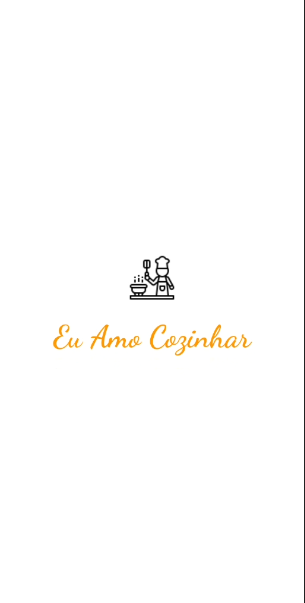
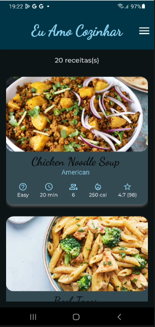
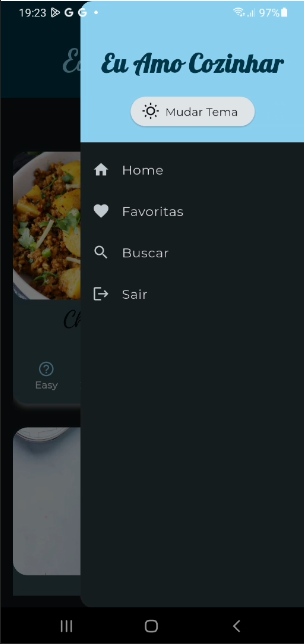
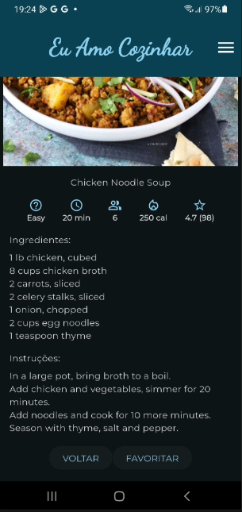

# 🍲 Eu Amo Cozinhar

Aplicativo mobile desenvolvido para apaixonados por culinária.  

Projeto desenvolvido no **Programa de Capacitação em Desenvolvimento Android e Multiplataforma Flutter - IMD/UFRN**  
Disciplina: **Desenvolvimento para Dispositivos Móveis com Flutter**  

---

## 📱 Demonstração

### 🎥 Vídeo

  

### 📸 Telas

  
  
  
  
  
  
  

---

## 🛠️ Tecnologias

- **Flutter**  
- **Dart**  
- **Supabase**  
